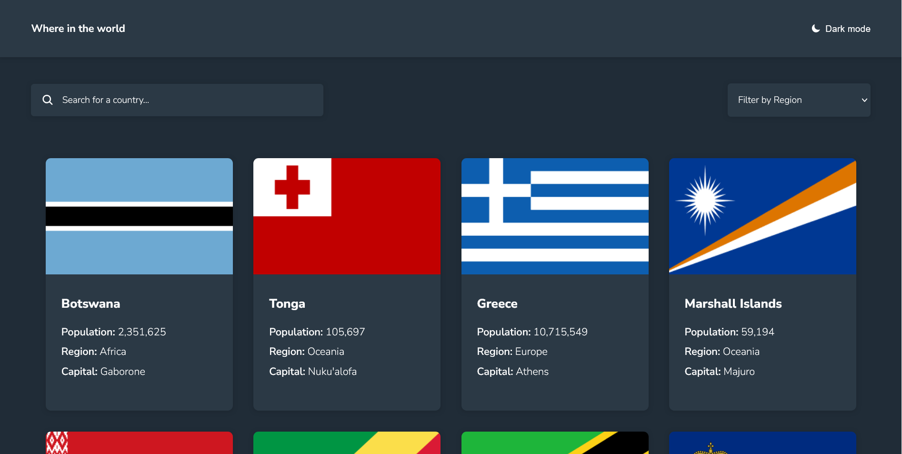

# REST Countries API
This is a Frontend mentor challenge where it consumes the REST Countires API to display country data and allows users to search by country name or filter by region.

---

## Screenshot

---

## Live Demo

- Solution URL: [Add solution URL here](https://your-solution-url.com)
- Live Site URL: [Add live site URL here](https://your-live-site-url.com)

---

## Project Purpose

- Practice consuming external APIs using JavaScript
- Organized the project into modules
- Implement country search by name and region filtering
- Applied the single responsability principle
- Set up simple routing to switch between views
- Used local data (`data.json`) as a fallback in case of API failure

---

## Built with

- HTML5 & CSS3
- Vanilla JavaScript
- REST Countries API - https://restcountries.com/
- CSS custom properties
- Flexbox
- CSS Grid
- Mobile-first workflow

---

## Author

- Frontend Mentor - [@Devnielote](https://www.frontendmentor.io/profile/Devnielote)
